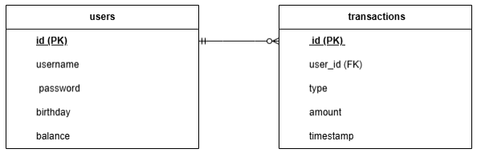
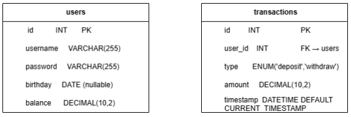

# Simple Virtual Online ATM System

## Group
* 408850419 郭鎮維
* 413853234 杜利維
* 413857011 陳奕樺

## 1. Demo Scenario Overview

### What will the demo include?
* User registration (with password confirmation)
* Login and session management
* Welcome message with the username
* Main menu interface
* Check account balance
* Deposit and withdraw money
* Access settings (account info & logout)
* Birthday setup popup (if not set)
* Settings page with:
    * Account name (view only)
    * Password (masked with show/hide toggle)
    * Birthday (editable only if not yet set)
    * Delete account (with confirmation)
    * Logout
* Password reset via “Forgot password?” link on login page
* Recent month transaction history page accessible from main menu

### User actions (functional flow triggers):
* Register with username and password
* Login with credentials
* Navigate through main menu
* Deposit/withdraw funds
* Update account information (password, birthday if not set)
* Delete account (with double confirmation)
* Use “Forgot password?” to reset password by verifying birthday
* View recent month transaction history

### Functional parts:
* User authentication (register, login, logout)
* Basic account handling (CRUD)
* Balance tracking and modification
* Password and birthday reset
* Transaction recording and monthly history display

## 2. Planned URL Endpoints

| URL Path | Method | HTTP Variables | Session Vars | DB Operations |
| :------- | :----- | :------------- | :----------- | :------------ |
| `/register.php` | POST | `username, password, confirm_pw` | - | `INSERT user` |
| `/login.php` | POST | `username, password` | `$_SESSION['user_id']` | `SELECT user` |
| `/main.php` | GET | - | `$_SESSION['user_id']` | `SELECT balance` |
| `/deposit.php` | POST | `amount` | `$_SESSION['user_id']` | `UPDATE balance (+), INSERT transaction` |
| `/withdraw.php` | POST | `amount` | `$_SESSION['user_id']` | `UPDATE balance (-), INSERT transaction` |
| `/settings.php` | GET | - | `$_SESSION['user_id']` | `SELECT user info` |
| `/update_info.php` | POST | `new_password, birthday (if editable)` | `$_SESSION['user_id']` | `UPDATE user info` |
| `/delete.php` | POST | `confirm_delete` | `$_SESSION['user_id']` | `DELETE user` |
| `/logout.php` | GET | - | `$_SESSION['user_id']` | `SESSION DESTROY` |
| `/forgot_password.php` | POST | `username, birthday, new_password` | - | `SELECT user & UPDATE password` |
| `/transactions.php` | GET | - | `$_SESSION['user_id']` | `SELECT transactions last 1 month` |

## 3. Database Design

### a. Entity-Relationship Diagram (ERD)

### b. Relational Model

### c. Normalization Explanation
The schema meets Third Normal Form (3NF):
* No repeating groups (1NF)
* All non-key attributes are fully functionally dependent on the primary key (2NF)
* No transitive dependencies between non-key columns (3NF)
* All data is separated logically: user data and transaction data are in their own tables, with appropriate foreign key usage to maintain data integrity.
